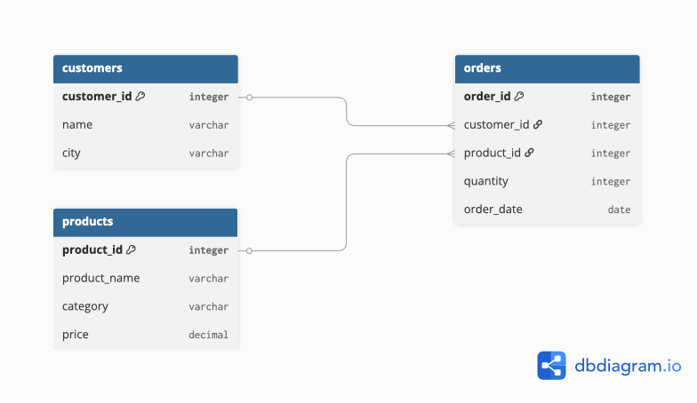
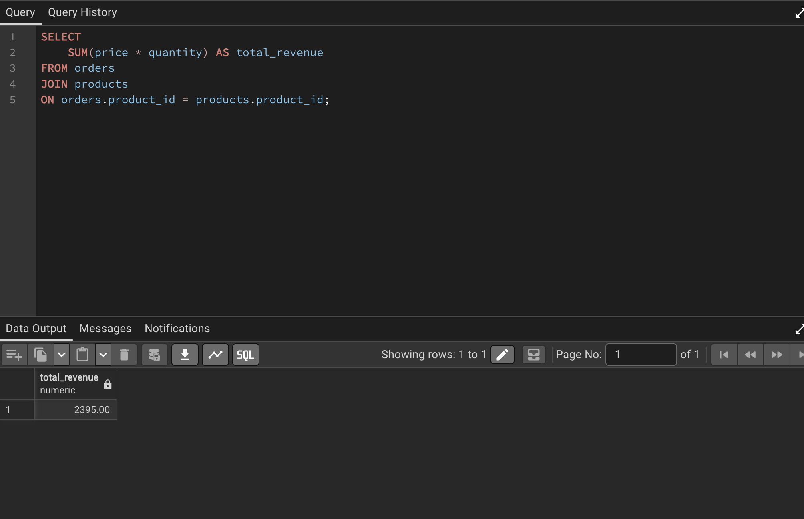
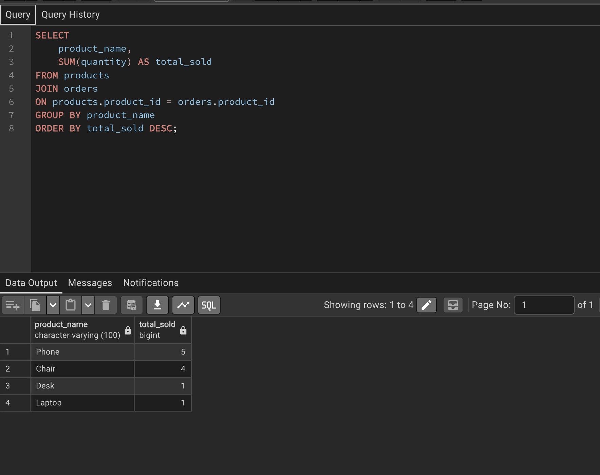
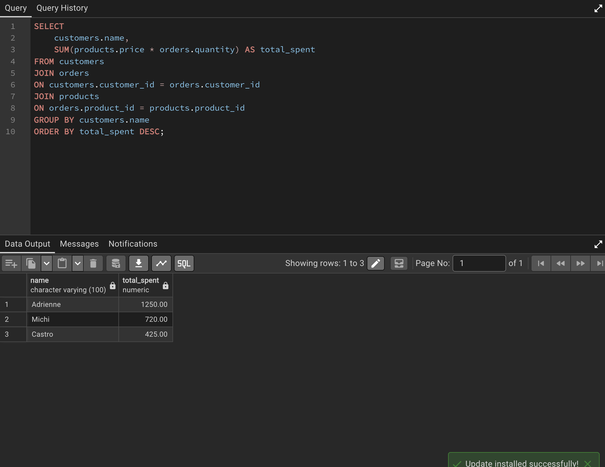

# 🛒 Online Shop Sales Analysis (PostgreSQL)

## 📌 Project Overview

This project simulates a real-world e-commerce database using PostgreSQL.

The objective was to design a relational database, populate it with sample business data, and answer common business questions using SQL.

The project demonstrates practical SQL skills required for Data Analyst positions, including data modeling, data querying, joins, and business analysis.

---

# 💼 Business Scenario

A small online shop wants to analyze its sales performance and customer behavior.

The company needs answers to questions such as:

- Which products sell the most?
- Which customers spend the most money?
- What is the total revenue?
- Which product categories perform best?

The goal is to transform raw sales data into meaningful business insights using SQL.

---

# 🗂 Database Structure

The project contains three relational tables:

- Customers
- Products
- Orders

The relationships between the tables:

```
Customers → Orders → Products
```

Database Schema:



---

# 🛠 SQL Skills Demonstrated

This project demonstrates the following SQL skills:

- CREATE TABLE
- INSERT INTO
- SELECT
- WHERE
- ORDER BY
- INNER JOIN
- GROUP BY
- Aggregate Functions
- SUM()
- COUNT()

---

# 📊 Business Questions Answered

The following business questions were analyzed:

✔ Display all customers

✔ Display all products

✔ Filter products by category

✔ Calculate total revenue

✔ Identify the best-selling products

✔ Identify the highest spending customer

---

# 📈 Key Insights

Based on the analysis:

- The total revenue generated by the online shop was **2,395 €**.
- The best-selling product was **Mouse** with **5 units sold**.
- The highest spending customer was **Anna**.
- Product sales performance can be analyzed by combining customer, order, and product data.

---

# 📸 Query Results

## Total Revenue




## Best-Selling Products




## Customer Spending Analysis



---

# 📂 Project Files

The project contains:

```
project-01-online-shop
│
├── README.md
├── database_schema.png
├── 01_create_tables.sql
├── 02_insert_data.sql
├── 03_business_queries.sql
└── screenshots
    ├── total_revenue.png
    ├── best_selling_products.png
    └── customer_spending.png
```

---

# 💻 Technologies

- PostgreSQL
- pgAdmin 4
- SQL
- GitHub

---

# 👩 Author

Andrea Rostas
